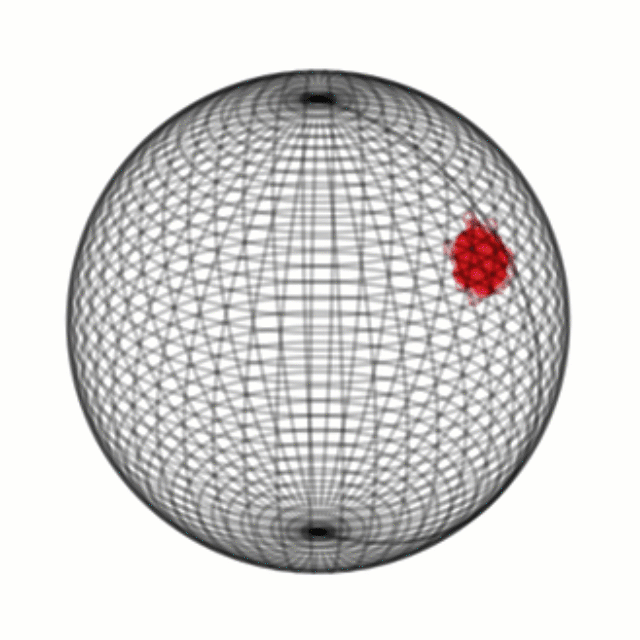

# Latent SDEs on Homogeneous Spaces

<p align="center">
  
</p>

This repository contains the **reference implementation** of

Zeng, S. and Graf, F. and Kwitt, R.
**Latent SDEs on Homogeneous Spaces**
*NeurIPS 2023*

Please cite as:

```bibtex
@inproceedings{Zeng23a,
    author    = {Zeng, Sebastian and Graf, Florian and Kwitt, Roland},
    title     = {Latent SDEs on Homogeneous Spaces},
    booktitle = {NeurIPS},
    year      = {2023}}
```
A preprint is available on [arXiv](https://arxiv.org/abs/2306.16248). In the following, we refer to the
paper as [**Zeng23a**].

We attach the [poster](/assets/NeurIPS23_poster.pdf) and [presentation slides](/assets/NeurIPS23_slides.pdf) that were presented at NeurIPS 2023.

# Overview

- [Setup](#setup)
- [Experiments](#experiments)
  - [Rotating MNIST](#rotating-mnist)
  - [Pendulum (Angle) Regression](#pendulum-angle-regression)
  - [Pendulum Interpolation](#pendulum-interpolation)
  - [Human Activity Classification](#human-activity-classification)
  - [PhysioNet 2012 Interpolation](#physionet-2012-interpolation)
  - [Irregular Sine (Toy) Experiment](#irregular-sine-toy-experiment)
- [Notebooks](#notebooks)

# Setup

### Example setup

The following example (1) sets up Anaconda Python (2023.09) in `/tmp/anaconda3`, (2) creates and activates a virtual environment `pytorch211`, (3) installs PyTorch 2.1.1 (according to the [PyTorch](https://pytorch.org/) installation instructions as of Dec. 2023) and (4) installs all dependencies, i.e., `einops, scipy, scikit-learn` and `gdown`. Assumes that the installed
CUDA version is 12.1.

```bash
cd /tmp/
wget https://repo.anaconda.com/archive/Anaconda3-2023.09-0-Linux-x86_64.sh
chmod +x Anaconda3-2023.09-0-Linux-x86_64.sh
./Anaconda3-2023.09-0-Linux-x86_64.sh -p /tmp/anaconda3
source source /tmp/anaconda3/bin/activate
conda create --name pytorch211 python=3.11
conda activate pytorch211
conda install pytorch torchvision torchaudio pytorch-cuda=12.1 -c pytorch -c nvidia
pip3 install einops scipy scikit-learn gdown
```

Next, (1) clone the repository as well as (2) the implementation of the power spherical distribution from De Cao and Aziz (see [here](https://arxiv.org/abs/2006.04437)) and set it up as listed:

```bash
cd /tmp/
git clone https://github.com/plus-rkwitt/LatentSDEonHS.git
git clone https://github.com/nicola-decao/power_spherical.git
cd LatentSDEonHS
mv ../power_spherical/power_spherical core/
```

If you can run (within the activated `pytorch211` environment)
```bash
python rotating_mnist.py --help
```
without any errors you are good to go.

### Test System

This code has been mainly tested on an Ubuntu Linux 22.04 with an Nvidia GTX 3090 GPU, CUDA 12.1 (driver version 530.30.02 ) and PyTorch v2.1.1. We have also tested the code on a system running PyTorch 1.13 (CUDA 11.8).

# Experiments

The following sections list the settings we used to run the
experiments from the manuscript. In the configurations listed
below, experiments are run on the first GPU in your system
(`cuda:0`).

The `logs` directory will hold (if `--enable-file-logging` is set and a valid directory is provided with `--log-dir`) **two** files per experiment, tracking (experiment-specific) performance measures, i.e., a JSON  (`.json`) file as well as an exact replica of the console output (the `.txt` file). Each file is identified by a unique integer-valued experiment identifier.

## Rotating MNIST

```bash
python rotating_mnist.py \
    --data-dir data_dir \
    --enable-file-logging  \
    --log-dir logs \
    --no-enable-checkpointing  \
    --checkpoint-dir None \
    --checkpoint-at  \
    --batch-size 32 \
    --lr 0.001 \
    --n-epochs 990 \
    --kl0-weight 0.0001 \
    --klp-weight 0.0001 \
    --pxz-weight 1.0 \
    --seed -1 \
    --restart 30 \
    --device cuda:0 \
    --z-dim 16 \
    --h-dim 32 \
    --n-deg 6 \
    --no-learnable-prior \
    --no-freeze-sigma  \
    --mc-eval-samples 1 \
    --mc-train-samples 1 \
    --loglevel debug \
    --n-filters 8
```

Below are the results of **10** runs with different random seeds.

|          Run         |      **Mean**    |   1   |   2   |   3   |   4   |   5   |   6   |   7   |   8   |   9   |  10   |
| ---------------------| ---------------- | ----- | ----- | ----- | ----- | ----- | ----- | ----- | ----- | ----- | ----- |
| MSE $\times 10^{-3}$ | **11.53 ± 0.38** | 12.03 | 11.47 | 11.04 | 12.02 | 11.80 | 11.45 | 11.74 | 11.57 | 10.89 | 11.34 |


## Pendulum (Angle) Regression
```bash
python pendulum_regression.py \
    --data-dir data_dir \
    --enable-file-logging  \
    --log-dir logs \
    --no-enable-checkpointing  \
    --checkpoint-dir None \
    --checkpoint-at  \
    --batch-size 64 \
    --lr 0.001 \
    --n-epochs 990 \
    --kl0-weight 1e-05 \
    --klp-weight 1e-06 \
    --pxz-weight 1.0 \
    --seed -1 \
    --restart 30 \
    --device cuda:0 \
    --z-dim 16 \
    --h-dim 32 \
    --n-deg 6 \
    --no-learnable-prior  \
    --no-freeze-sigma  \
    --mc-eval-samples 1 \
    --mc-train-samples 1 \
    --loglevel debug \
    --aux-weight 10.0 \
    --aux-hidden-dim 32 \
    --use-atanh
```

|          Run         |      **Mean**    |   1   |   2   |   3   |   4   |   5   |   6   |   7   |   8   |   9   |  10   |
| ---------------------| ---------------- | ----- | ----- | ----- | ----- | ----- | ----- | ----- | ----- | ----- | ----- |
| MSE $\times 10^{-3}$ |  **3.84 ± 0.35** | 3.58  | 3.47  | 3.76  | 4.32  | 3.48  | 4.35  | 4.16  | 4.07  | 3.57  | 3.64  |


## Pendulum Interpolation

```bash
python pendulum_interpolation.py \
    --data-dir data_dir \
    --enable-file-logging  \
    --log-dir logs \
    --no-enable-checkpointing  \
    --checkpoint-dir None \
    --checkpoint-at  \
    --batch-size 64 \
    --lr 0.001 \
    --n-epochs 990 \
    --kl0-weight 1e-05 \
    --klp-weight 1e-06 \
    --pxz-weight 1.0 \
    --seed -1 \
    --restart 30 \
    --device cuda:0 \
    --z-dim 16 \
    --h-dim 32 \
    --n-deg 6 \
    --no-learnable-prior  \
    --no-freeze-sigma  \
    --mc-eval-samples 1 \
    --mc-train-samples 1 \
    --loglevel debug \
    --use-atanh
```

Below are the results of **10** runs with different random seeds:

|          Run         |     **Mean**    |   1   |   2   |   3   |   4   |   5   |   6   |   7   |   8   |   9   |   10  |
| ---------------------| --------------- | ----- | ----- | ----- | ----- | ----- | ----- | ----- | ----- | ----- | ----- |
| MSE $\times 10^{-3}$ | **8.15 ± 0.06** | 8.13  | 8.09  | 8.16  | 8.06  | 8.18  | 8.14  | 8.20  | 8.13  | 8.17  | 8.11  |


## Human Activity Classification

For the human activity recognition experiment, just run the `activity_classification.py` script with default
arguments. **Note**: different to the manuscript, we do reconstruct the input here at the available timepoints (and at all available coordinates). This is not necessary (as also pointed out by several prior works), but in that manner, all experiments are fully consistent in their setup.

```bash
python activity_classification.py \
    --data-dir data_dir \
    --enable-file-logging  \
    --log-dir logs \
    --no-enable-checkpointing  \
    --checkpoint-dir None \
    --checkpoint-at  \
    --batch-size 64 \
    --lr 0.001 \
    --n-epochs 990 \
    --kl0-weight 0.0001 \
    --klp-weight 0.0001 \
    --pxz-weight 1.0 \
    --seed -1 \
    --restart 30 \
    --device cuda:0 \
    --z-dim 16 \
    --h-dim 128 \
    --n-deg 4 \
    --no-learnable-prior  \
    --freeze-sigma  \
    --mc-eval-samples 1 \
    --mc-train-samples 1 \
    --loglevel debug \
    --aux-weight 10.0 \
    --aux-hidden-dim 32 \
    --use-atanh
```

Below are the results of **8** runs with different random seeds:

|      Run     |     **Mean**    |   1   |   2   |   3   |   4   |   5   |   6   |   7   |   8   |   9   |  10   |
| -------------| --------------- | ----- | ----- | ----- | ----- | ----- | ----- | ----- | ----- | ----- | ----- |
|    Acc [%]   | **90.56 ± 0.45**| 90.03 | 90.82 | 90.64 | 90.78 | 90.16 | 90.22 | 90.80 | 89.91 | 91.12 | 91.14 |


## PhysioNet 2012 Interpolation

The PhysioNet 2012 interpolation experiments can be found in Section 4.2. of [**Zeng23a**].

### Quantization of 6 minutes

```bash
python physionet_interpolation.py \
    --data-dir data_dir \
    --enable-file-logging  \
    --log-dir logs \
    --no-enable-checkpointing  \
    --checkpoint-dir None \
    --checkpoint-at  \
    --batch-size 64 \
    --lr 0.001 \
    --n-epochs 990 \
    --kl0-weight 0.0001 \
    --klp-weight 0.0001 \
    --pxz-weight 1.0 \
    --seed -1 \
    --restart 30 \
    --device cuda:0 \
    --z-dim 16 \
    --h-dim 64 \
    --n-deg 6 \
    --no-learnable-prior  \
    --freeze-sigma  \
    --mc-eval-samples 1 \
    --mc-train-samples 1 \
    --loglevel debug \
    --n-dec-layers 2 \
    --dec-hidden-dim 100 \
    --no-use-atanh  \
    --sample-tp 0.5 \
    --quantization 0.1
```
Below are the results of **10** runs with different random seeds at different sampling rates $p$, which means that only a fraction $p$ of timepoints (at which there are actual measurements) are taken as model input. We list the testing **impute MSE** multplied with $10^{-3}$, which is the MSE computed on the $1-p$ fraction of timepoints that are not used as model input. In case of $p=1$, we list the MSE at all timepoints.

|       Sampling Rate    |     **Mean**    |   1   |   2   |   3   |   4   |   5   |   6   |   7   |   8   |   9   |   10  |
| -----------------------| --------------- | ----- | ----- | ----- | ----- | ----- | ----- | ----- | ----- | ----- | ----- |
|           0.5          | **3.14 ± 0.03** | 3.16  | 3.15  | 3.18  | 3.14  | 3.12  | 3.09  | 3.18  | 3.11  | 3.13  | 3.11  |
|           0.6          | **3.06 ± 0.05** | 3.00  | 3.06  | 3.06  | 3.12  | 3.01  | 3.09  | 3.11  | 3.04  | 2.97  | 3.10  |
|           0.7          | **3.01 ± 0.05** | 2.96  | 2.98  | 3.08  | 3.05  | 2.97  | 2.99  | 2.99  | 3.04  | 2.98  | 3.08  |
|           0.8          | **2.94 ± 0.07** | 2.96  | 2.94  | 2.94  | 3.08  | 2.88  | 2.93  | 3.03  | 2.91  | 2.92  | 2.84  |
|           0.9          | **3.00 ± 0.08** | 2.91  | 3.08  | 3.00  | 3.04  | 3.02  | 2.82  | 3.08  | 3.03  | 3.02  | 2.98  |
|           1.0          | **1.55 ± 0.01** | 1.54  | 1.55  | 1.54  | 1.57  | 1.56  | 1.55  | 1.53  | 1.54  | 1.56  | 1.55  |


### Quantization of 1 minute

```bash
python physionet_interpolation.py \
    --data-dir data_dir \
    --enable-file-logging  \
    --log-dir logs \
    --no-enable-checkpointing  \
    --checkpoint-dir None \
    --checkpoint-at  \
    --batch-size 64 \
    --lr 0.001 \
    --n-epochs 990 \
    --kl0-weight 0.0001 \
    --klp-weight 0.0001 \
    --pxz-weight 1.0 \
    --seed -1 \
    --restart 30 \
    --device cuda:0 \
    --z-dim 16 \
    --h-dim 64 \
    --n-deg 6 \
    --no-learnable-prior  \
    --freeze-sigma  \
    --mc-eval-samples 1 \
    --mc-train-samples 1 \
    --loglevel debug \
    --n-dec-layers 2 \
    --dec-hidden-dim 100 \
    --no-use-atanh  \
    --sample-tp 0.5 \
    --quantization 0.016
```
Below are the results of **5** runs with different random seeds at different sampling rates $p$, which means that only a fraction $p$ of timepoints (at which there are actual measurements) are taken as model input. We list the testing **impute MSE** multplied with $10^{-3}$, which is the MSE computed on the $1-p$ fraction of timepoints that are not used as model input. In case of $p=1$, we list the MSE at all timepoints.

| Sampling Rate |     **Mean**    |   1   |   2   |   3   |   4   |   5   |
| ------------- | --------------- | ----- | ----- | ----- | ----- | ----- |
|      0.5      | **3.14 ± 0.04** | 3.18  | 3.09  | 3.11  | 3.19  | 3.12  |
|      0.6      | **3.03 ± 0.03** | 3.06  | 3.06  | 3.03  | 2.99  | 3.02  |
|      0.7      | **3.01 ± 0.02** | 3.02  | 2.98  | 3.02  | 3.03  | 3.02  |
|      0.8      | **2.99 ± 0.10** | 3.12  | 2.95  | 3.06  | 2.89  | 2.94  |
|      0.9      | **2.96 ± 0.04** | 2.84  | 3.01  | 3.09  | 2.97  | 2.88  |
|      1.0      | **1.53 ± 0.01** | 1.53  | 1.55  | 1.53  | 1.53  | 1.53  |

---

We further list the testing impute MSE of these runs after only `390 epochs`, i.e., with only 40% of training time. As can be seen, increasing training time consistently improves performance, but only to a small degree.

| Sampling Rate |     **Mean**    |   1   |   2   |   3   |   4   |   5   | 
| ------------- | --------------- | ----- | ----- | ----- | ----- | ----- | 
|      0.5      | **3.20 ± 0.02** | 3.16  | 3.22  | 3.21  | 3.19  | 3.21  |
|      0.6      | **3.14 ± 0.03** | 3.15  | 3.12  | 3.17  | 3.14  | 3.10  |
|      0.7      | **3.10 ± 0.04** | 3.11  | 3.16  | 3.06  | 3.08  | 3.10  |
|      0.8      | **3.08 ± 0.06** | 3.09  | 3.05  | 3.19  | 3.01  | 3.08  |
|      0.9      | **3.07 ± 0.07** | 3.02  | 3.18  | 3.08  | 3.02  | 3.06  |
|      1.0      | **1.67 ± 0.02** | 1.64  | 1.68  | 1.67  | 1.68  | 1.67  |


## Irregular Sine (Toy) Experiment

`irregular_sine_interpolation.py` implements a Latent SDE model for the *irregular sine* data from [torchsde](https://github.com/google-research/torchsde/). You can run the code with

```bash
python irregular_sine_interpolation.py \
    --enable-file-logging  \
    --log-dir logs \
    --enable-checkpointing  \
    --checkpoint-dir checkpoints \
    --checkpoint-at 90 390 990 2190 3990  \
    --lr 0.001 \
    --n-epochs 3990 \
    --kl0-weight 0.001 \
    --klp-weight 0.01 \
    --pxz-weight 1.0 \
    --seed -1 \
    --restart 30 \
    --device cuda:0 \
    --z-dim 3 \
    --h-dim 3 \
    --n-deg 6 \
    --no-learnable-prior  \
    --freeze-sigma  \
    --mc-eval-samples 10 \
    --mc-train-samples 10 \
    --loglevel debug
```

Note that there is not `--batch-size` argument, as the batch-size, by construction of that experiment, equals one; hence, running the experiments for, e.g., `--n-epochs 3990` corresponds to 3,990 update
steps. The introductory figure for this README shows (in blue) the progression of several (500) latent paths on the 2-sphere, (as `--z-dim 3`)
across the time interval [0,1].

# Notebooks / Tutorials

Several notebooks are available (in the `notebooks` subfolder) to analyze and visualize the results, aside from the command-line tracking of performance measures.

